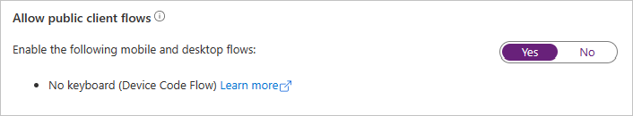

<!-- markdownlint-disable MD002 MD041 -->

在此练习中，你将使用管理中心Azure Active Directory Azure AD 应用程序。In this exercise you will create a new Azure AD application using the Azure Active Directory admin center.

1. 打开浏览器，并转到 [Azure Active Directory 管理中心](https://aad.portal.azure.com)。然后，使用 **个人帐户**（亦称为“Microsoft 帐户”）或 **工作或学校帐户** 登录。Open a browser and navigate to the [Azure Active Directory admin center](https://aad.portal.azure.com) and login using a **personal account** (aka: Microsoft Account) or **Work or School Account**.

1. 选择左侧导航栏中的“**Azure Active Directory**”，再选择“**管理**”下的“**应用注册**”。Select **Azure Active Directory** in the left-hand navigation, then select **App registrations** under **Manage**.

    

1. 选择“新注册”。Select **New registration**. 在“注册应用”页上，按如下方式设置值。On the **Register an application** page, set the values as follows.

    - 将“名称”设置为“`.NET Core Graph Tutorial`”。Set **Name** to `.NET Core Graph Tutorial`.
    - 将“受支持的帐户类型”设置为“任何组织目录中的帐户和个人 Microsoft 帐户”。Set **Supported account types** to **Accounts in any organizational directory and personal Microsoft accounts**.
    - 在 **"重定向 URI"** 下，将下拉列表更改为"公共客户端 **(移动&桌面) "，** 将值设置为 `https://login.microsoftonline.com/common/oauth2/nativeclient` 。Under **Redirect URI**, change the dropdown to **Public client (mobile & desktop)**, and set the value to `https://login.microsoftonline.com/common/oauth2/nativeclient`.

    

1. 选择“**注册**”。Select **Register**. 在 **".NET Core Graph 教程**"页上，复制 Application **(客户端) ID** 的值并保存它，你将在下一步中需要该值。On the **.NET Core Graph Tutorial** page, copy the value of the **Application (client) ID** and save it, you will need it in the next step.

    

1. 选择“**管理**”下的“**身份验证**”。Select **Authentication** under **Manage**. 找到"**高级设置"** 部分，将"**允许公共客户端** 流"开关更改为 **"是"，** 然后选择"保存 **"。**Locate the **Advanced settings** section and change the **Allow public client flows** toggle to **Yes**, then choose **Save**.

    
